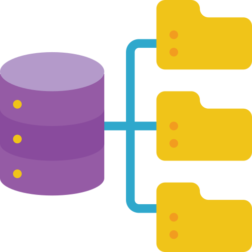
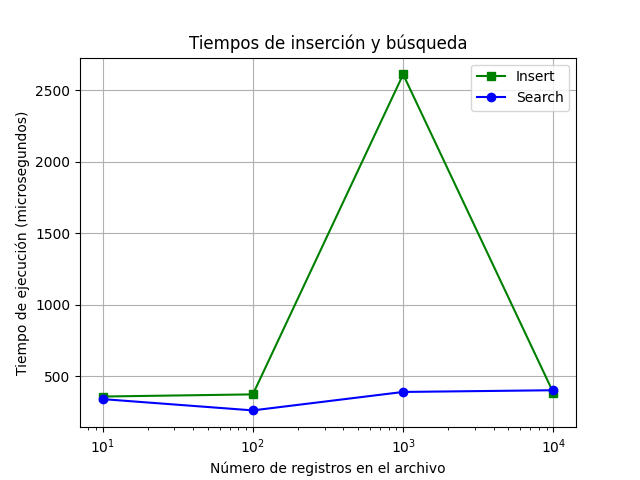

[](https://github.com/hamzamohdzubair/redant)
[](https://hamzamohdzubair.github.io/redant/)
[](https://docs.rs/crate/redant/latest)
# **$${\color{White} BD \space II \space PROYECTO \space I }$$** 
Primer proyecto de Base de Datos II



`Introducción al Proyecto`: https://drive.google.com/file/d/1-auEMNvIRbiHespnPApBNp5qlNwyF8bR/view?usp=share_link
`Explicación y uso del `Extendible Hash File`: https://drive.google.com/file/d/11JQki-cy1gmV7R9SYL1FayKPsuW50S0C/view?usp=sharing
`Explicación y uso del Extendible Sequential File`:https://drive.google.com/file/d/1AhtniXcL9rfSksAgtFWR9XqoKynJoAF7/view?usp=sharing
`Explicación y demostración del uso de la GUI y del Parser SQL`: https://drive.google.com/file/d/12GHRUrxvQkPq4pWBqPPOgtY-4bl0y7Ba/view?usp=share_link

# **Introducción**

**Objetivo general**:
Implementar un `sequential file` y un `extendible hash file` como técnicas de organización de archivos para la rápida ejecución de consultas SQL de inserción, búsqueda y eliminación.

**Dominio de datos**:
Se han utilizado dos datasets en formato csv descargadas de la plataforma `Kaggle`.
- `credits.csv`
- `titles.csv`

**Resultado esperado**: Con la implementación las técnicas mencionadas se espera un mejor performace en la ejecución de consultas básicas SQL. Esto implica que la solicitud de datos sea mas rápida a diferencia de realizar un escaneo completo de los archivos. 

# **Técnicas de organización de archivos**

## **SEQUENTIAL FILE**

### **Inserción**
> Para cada registro nuevo se verifica que no esten en el archivo llamando a al metodo *search()* . Se hace busqueda del maximo elemento menor en el archivo principal conplejidad *O(log(n))* y tambien en el archivo auxliar Complejidad *O(k)*. Se hace el intercambio de punteros. Y se inserta en al archivo auxliar. Complejidad O(1).

>__Note__ _**Para llamar a la función inserción:**_
```cpp
bool add(Rtitles new_record){}
```


### **Búsqueda**
>Ya que cada registro es de lonngitud variable se opta por incorporar un archivo metadata al archivo principal con la ubicacion fisica de cada registro. De acuerdo al metadata se recorre el archivo principal aplicando el algoritmo regular de busqueda binaria. Si no se encuntra el archivo, se busca en el archivo auxiliar con busqueda lineal.

>__Note__ _**Para llamar a la función búsqueda:**_
```cpp
Rtitles search(string key){}
```


### **Eliminación**
>Se ubica el ultimo registro registro anterior y se hace intercambio de punteros caso contrario solo se actuliza el estado del registro a -1. Es decir se aplica la estrategia del marcado.

>__Note__ _**Para llamar a la función eliminar:**_
```cpp
bool remove(string key){}
```

### **Búsqueda por rango**
> Aprovechando el soporte de busqueda por rango de la tecnica. Se ubica el primer elemento menor en el archivo principal o axuliar y se lee los registros siguientes, siguiendo los punteros.


>__Note__ _**Para llamar a la función búsqueda por rangos:**_
```cpp
vector<Rtitles> rangeSearch(string begin_key, string end_key){}
```

## **EXTENDIBLE HASH FILE**

### **Inserción**
> Se aplica la función hash a la llave primaria del registro insertado que localiza su bucket correspondiente. Esta operación tiene un costo de *O(1)* si es que no existe overflow del bucket. Caso contrario, se crea otro bucket y se realiza el rehashing de los elementos, agregándole un costo computacional adicional. Asimismo, puede darse el caso de que el overflow cause la expansión del directorio.

```cpp
void insert(const Record& new_record);
```

### **Búsqueda**
> Se aplica la función hash a la llave primaria del registro buscado que localiza su bucket correspondiente. Finalmente, se itera sobre el bucket para encontrar el dicho registro. La complejidad seria *O(1) + O(k)* donde *k* es el número de registros en el bucket.

```cpp
Record search(int key);
```

### **Eliminación**
> Se aplica la función hash a la llave primaria del registro que se desea eliminar para localizar su bucket correspondiente. Se busca el registro en el bucket y se elimina del contenedor. Cuando el bucket queda completamente vacío, este se elimina. También, puede darse el caso que el tamaño del directorio se reduzca. 

```cpp
void remove(int key);
```

# **Experimentación**

Tiempos ejecutación del `Sequential File`


Tiempos ejecutación del `Extendible Hash File`



En promedio se observa que la inserción y búsqueda para esta técnica de organización es constante *O(1)*.
Notese que la fluctuación de tiempo en la inserción puede deberse el bucket split y posterior rehashing de los registros.


